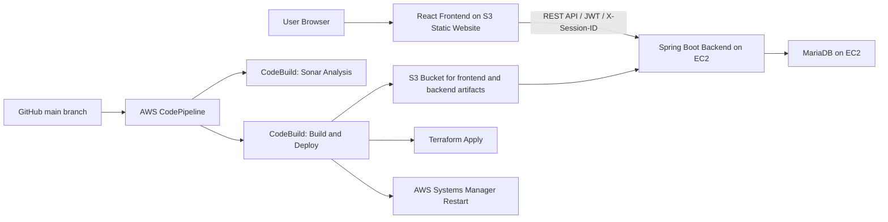

# Hobby Shop App Presentation

## Title Slide

**U197 Hobbies: Full-Stack E-Commerce Platform**

- Presenter: Nicholas Mathias
- Stack: React + Spring Boot + MariaDB + AWS
- Focus area: cart experience, guest-to-user cart merge, and AWS deployment automation

---

## 1. Problem & Solution (1 min)

### Business Problem

- Hobby shoppers need a smooth buying experience across browsing, cart management, checkout, and order tracking.
- Many users browse as guests first, then decide to log in only when they are ready to buy.
- If the cart is lost during login or registration, conversion drops and user trust suffers.
- A second challenge was making the application reliably deployable to AWS without manual steps every time code changed.

### My Solution

- Built a full-stack hobby shop platform with a React storefront and Spring Boot API.
- Implemented a dual cart model that supports both guest users and authenticated users.
- Preserved guest carts with a session ID, then merged them into the user cart on login or registration.
- Automated build, infrastructure, artifact delivery, and backend restart using AWS CodePipeline, CodeBuild, S3, Terraform, and SSM.

### Key Value

- Better customer experience: users can shop first and authenticate later.
- Better business continuity: the deployment path is repeatable and infrastructure is defined as code.

---

## 2. Architecture Overview (2 min)

### System Design

### Frontend

- React with Vite for a fast SPA development workflow.
- Global cart state handled through `CartProvider` so the cart badge, cart page, and product cards stay synchronized.
- Axios interceptors add the JWT for signed-in users and `X-Session-ID` for guest users.
- Routing is handled with React Router, including checkout/login flows.

### Backend

- Spring Boot API exposes product, cart, auth, order, review, brand, and category endpoints.
- Spring Security + JWT handles authentication and protected routes.
- Cart logic supports both customer-linked carts and session-linked carts.
- MariaDB stores users, products, carts, cart items, and orders.

### Technology Choices

- React: strong component model and state sharing for cart UX.
- Spring Boot: fast API development with clear controller/service/repository layers.
- MariaDB: relational model fits products, carts, orders, and users well.
- AWS + Terraform: practical cloud deployment with reproducible infrastructure.

### Design Tradeoff

- I used a single EC2 instance for both Spring Boot and MariaDB to stay within project budget and keep operations manageable.
- That is not the final production pattern, but it was a pragmatic choice for a capstone-scale deployment.

---

## 3. Live Demo (3 min)

### Demo Goal

Show the end-to-end shopping flow, with emphasis on the cart experience and guest-to-user transition.

### Demo Script

1. Open the live frontend.
2. Browse products and add one or two items to the cart.
3. Point out the cart badge in the navbar updating immediately.
4. Open the cart page and show:
   - quantity updates
   - remove item action
   - subtotal calculation
   - guest warning message
5. While still in guest mode, explain that the cart is tracked by a session ID.
6. Log in or register.
7. Return to the cart and show that the guest cart was preserved and merged into the authenticated cart.
8. Continue to checkout or order flow to show the user journey remains intact.

### What to Narrate During the Demo

- “The cart is not just local UI state. It is backed by the API.”
- “Guest shoppers get a session-based cart, so they can start buying immediately.”
- “When the user logs in, the backend merges the guest cart into the account cart.”
- “That merge was one of the hardest technical problems in the project.”

### Optional Demo Backup

If live login or AWS is slow, show these instead:

- the cart page UI
- the navbar cart counter
- the login flow carrying session context
- the CodePipeline definition and Terraform files

---

## 4. Technical Deep Dive (2 min)

### Challenge 1: Guest Cart to User Cart Merge

This was the most interesting problem because the cart exists before the user identity exists.

### How It Works

- The frontend stores a guest `sessionId` in local storage.
- Axios sends `X-Session-ID` only when the user is not authenticated.
- The backend cart controller looks for the cart session in this order:
  - existing cookie
  - request header
  - generate a new UUID
- On login or registration, the frontend sends the session ID to the auth endpoints.
- The backend then merges the guest cart into the authenticated user cart.

### Why This Is Tricky

- The same product can exist in both carts.
- A cart can belong either to a guest session or a customer account.
- The login flow must succeed even if cart merge has a problem.
- The UI must refresh after auth so the correct cart appears everywhere.

### Merge Strategy

- If the product already exists in the user cart, increment quantity.
- If it does not exist, create a new cart item in the user cart.
- After the merge, delete the guest session cart.

### Challenge 2: Getting the App Live Through AWS Pipeline

- The build had to produce both backend and frontend outputs.
- The frontend needed the live EC2 public IP injected as the API base URL at build time.
- Terraform had to manage infrastructure that already existed, so imports were needed.
- The backend service then had to be restarted remotely after the new JAR was uploaded.

### Why This Matters

- It turns deployment from a manual sequence into a repeatable workflow.
- It also exposed the operational side of software engineering, not just coding.

---

## 5. AWS Infrastructure (1 min)

### Deployed Resources

- S3 static website hosting for the React frontend
- EC2 instance for the Spring Boot backend
- MariaDB running on the EC2 instance
- IAM role and instance profile for S3 read access and SSM management
- Security group exposing port 8080 and SSH
- CodePipeline connected to GitHub
- CodeBuild projects for analysis and deployment
- CloudWatch alarms and SNS notifications
- AWS Budget alert for cost control

### Infrastructure as Code

- Terraform defines the core AWS resources.
- The S3 bucket is used for frontend hosting, application artifacts, and Terraform state.
- EC2 `user_data` installs Java, MariaDB, loads the schema, downloads the JAR, and starts the service.

### Deployment Flow

1. Push to `main`
2. CodePipeline starts
3. Sonar analysis runs
4. Build compiles Spring Boot and React
5. Artifacts upload to S3
6. Terraform applies infrastructure changes
7. SSM restarts the backend service on EC2

---

## 6. Lessons Learned (1 min)

### Technical Lessons

- Cart behavior needs to be designed as a full workflow, not as a page component.
- Guest and authenticated user paths should be treated as two distinct states with a clean handoff.
- Keeping deployment automated is just as important as getting features to work locally.

### What I Learned from the Hardest Parts

- For cart merging:
  - the key was treating session identity as first-class data
  - backend merge logic was safer than trying to merge in the browser
  - refreshing cart state after auth prevented stale UI problems

- For AWS pipeline deployment:
  - infrastructure drift is real, which is why Terraform imports mattered
  - deployment reliability depends on artifact paths, IAM permissions, restart automation, and environment variables all lining up
  - small infrastructure choices can create large debugging effort later

### Final Reflection

The project pushed me beyond feature building into real full-stack ownership: frontend state management, backend service design, authentication flow, cloud deployment, and infrastructure as code.

---

## Presenter Notes

### Key Code Areas to Reference if Asked

- Frontend cart state: `Client/hobby-shop-frontend/src/contexts/CartProvider.jsx`
- Frontend session/JWT request handling: `Client/hobby-shop-frontend/src/services/api.js`
- Frontend cart API calls: `Client/hobby-shop-frontend/src/services/cartService.js`
- Login/register carrying session ID: `Client/hobby-shop-frontend/src/services/authService.js`
- Cart page UX: `Client/hobby-shop-frontend/src/pages/CartPage.jsx`
- Guest/auth cart endpoints: `Server/src/main/java/com/hobby/shop/controller/CartController.java`
- Merge on auth: `Server/src/main/java/com/hobby/shop/controller/AuthController.java`
- Merge implementation: `Server/src/main/java/com/hobby/shop/service/impl/CartServiceImpl.java`
- AWS infrastructure: `main.tf`, `outputs.tf`, `variables.tf`
- AWS build/deploy pipeline: `buildspec.yml`, `buildspec-sonar.yml`, `pipeline.json`

### Short Closing Line

“The most important thing I built here was continuity: continuity of the shopping experience for the user, and continuity of delivery through the AWS deployment pipeline.”